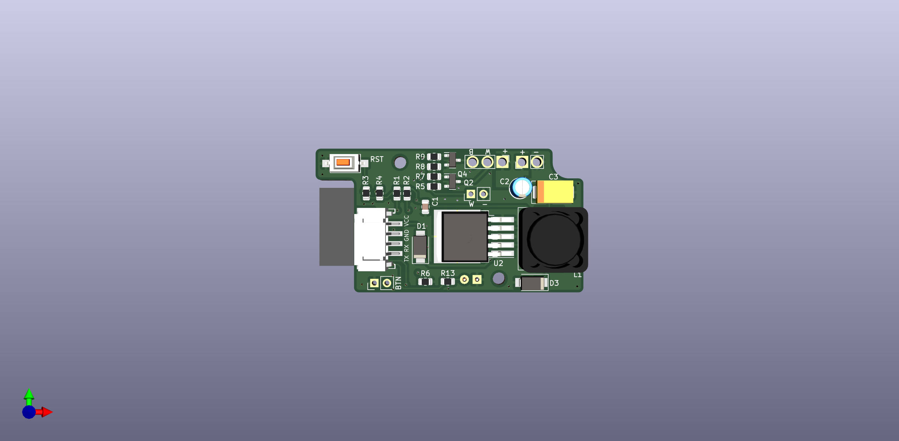

# Esp8266_2ChannelPwm
## ESP8266 based 2-Channel LED Controller 
* ESP12F 
* LM2596S step-down converter
* 2 PWM Channels (white & blue light)
* AO3400A N-Channel MOSFET to directly drive LEDs (tested with 24V 1A)
* onboard RST button
* connector for PGM button, to be used as general purpose button as well
* connector for THT LED
* JST programming connector
* power in / out soldering with up to 1.75mm diameter
* designed to fit into Hammond Electronics 1551HFLBK 60 x 35 x 20 ABS Euro-Case

## Schematic

## PCB

## Case

## Complete 
